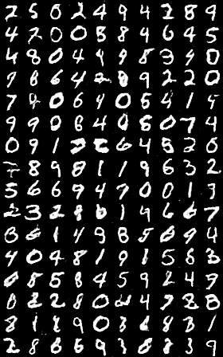

# mnist-gan

Inspired from [v6x/keras-project-template](https://github.com/v6x/keras-project-template), which is a sample implementation of CycleGAN

To train:
```bash
$ pip install -r requirements.txt
$ python train_dcgan.py --config configs/dcgan_config.yml
```

Sample results, with 180 epochs

